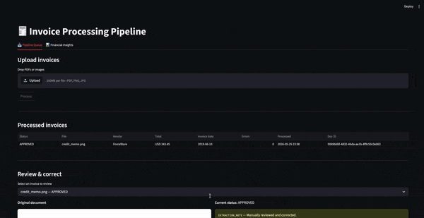
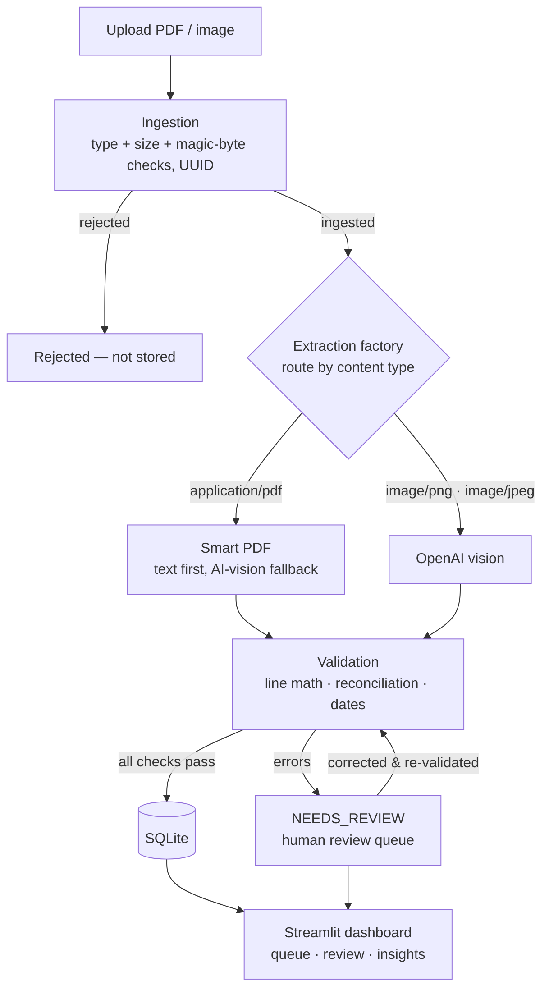

# 🧾 Intelligent Invoice & Document Processing Pipeline (IDP)

A production-shaped pipeline that ingests invoices (PDF or image), extracts
structured data with a deterministic parser **or** an AI vision model, validates
it against strict business rules, and surfaces everything in a Streamlit
dashboard — with a human-in-the-loop review queue for anything that doesn't
reconcile.
 

 
---

## What it does

Drop one or more invoices into the dashboard and each one is:

1. **Ingested** — validated for type and size, content-sniffed to block spoofed
   files, and assigned a UUID tracking ID.
2. **Extracted** — routed to the right engine: `pdfplumber` for text PDFs, an
   OpenAI vision model for images, and a smart fallback that renders *scanned*
   PDFs to images for the vision model.
3. **Validated** — line-item math, full total reconciliation (with a rounding
   tolerance), and date sanity checks. Anything that fails is flagged
   `NEEDS_REVIEW` with a human-readable reason.
4. **Persisted** — stored in SQLite and shown in the queue, with a side-by-side
   review screen for correcting and re-approving flagged invoices, plus
   aggregate analytics.

## Architecture



A single `doc_id` (minted at ingestion) threads through every stage, tying each
record to its source document end to end.

## Engineering highlights

- **Defensive ingestion** — files are validated by *content*, not just
  extension: magic-byte sniffing rejects a PNG renamed `invoice.pdf`. Filenames
  are sanitized against path traversal.
- **Pluggable extraction (Strategy pattern)** — every extractor implements one
  `ExtractionProvider` contract, and a factory routes by content type. Adding a
  new provider is one line; the rest of the app never changes.
- **Exact money math** — all amounts use `Decimal`, never `float`, so
  reconciliation is penny-accurate. Comparisons use a small tolerance for
  real-world rounding.
- **Honest validation** — a missing field is *skipped* (warning), not failed;
  only genuine, verifiable errors force `NEEDS_REVIEW`. Each issue carries a
  machine code and a human message.
- **Repository pattern** — all database access lives behind one class, so the
  backend (SQLite today) is swappable.
- **No hardcoded secrets** — all config (API key, model name, paths) loads from
  a `.env` file. Structured logging records every pipeline stage.
- **Tested** — 29 `pytest` tests cover ingestion validation and the full
  validation engine.

## Tech stack

| Layer            | Choice                                              |
|------------------|-----------------------------------------------------|
| Language         | Python                                              |
| UI / Dashboard   | Streamlit                                           |
| Text extraction  | pdfplumber                                          |
| AI extraction    | OpenAI vision (`gpt-4o-mini` by default, swappable) |
| PDF rendering    | PyMuPDF                                             |
| Data modelling   | Pydantic v2                                         |
| Database         | SQLite (`sqlite3`)                                  |
| Testing          | pytest                                              |

## Project structure

```
idp-pipeline/
├── app/streamlit_app.py          # dashboard: queue, review, insights
├── config/settings.py            # env-driven config
├── src/
│   ├── ingestion/                # validate, sanitize, assign UUID, store
│   ├── extraction/               # provider contract, 3 providers, factory
│   ├── validation/               # checks + validator (the verdict)
│   ├── persistence/              # SQLite repository
│   ├── utils/logger.py           # console + rotating file logging
│   └── pipeline.py               # orchestrator: ingest->extract->validate->save
├── tests/                        # pytest suite (29 tests)
├── storage/                      # uploads, quarantine, idp.db (gitignored)
├── requirements.txt
└── .env.example
```

## Getting started

```bash
# 1. Clone and enter the project
git clone https://github.com/YOUR_USERNAME/idp-pipeline.git
cd idp-pipeline

# 2. Create and activate a virtual environment
python -m venv .venv
source .venv/bin/activate          # Windows: .venv\Scripts\activate

# 3. Install dependencies
pip install -r requirements.txt

# 4. Configure
cp .env.example .env               # then add your OpenAI key (optional, see below)

# 5. Run the dashboard
streamlit run app/streamlit_app.py

# 6. Run the tests
pytest -q
```

**About the OpenAI key:** text-based PDFs are processed entirely for free by
`pdfplumber` — no key needed. A key is only required to extract *images* and
*scanned* PDFs via the vision model. Add it to `.env` as `OPENAI_API_KEY=...`.

## Configuration

All settings have sensible defaults and can be overridden in `.env`:

| Variable                 | Default          | Purpose                       |
|--------------------------|------------------|-------------------------------|
| `OPENAI_API_KEY`         | _(empty)_        | Enables AI vision extraction  |
| `OPENAI_MODEL`           | `gpt-4o-mini`    | Vision model to use           |
| `IDP_MAX_FILE_SIZE_MB`   | `10`             | Per-file upload ceiling       |
| `IDP_DB_PATH`            | `storage/idp.db` | SQLite database location      |
| `IDP_LOG_LEVEL`          | `INFO`           | Logging verbosity             |

## Validation rules

- **Line items:** `quantity x unit_price = line_total` for each line.
- **Subtotal:** line totals sum to the stated subtotal.
- **Grand total:** `subtotal + shipping - discount + tax + adjustments = grand_total`.
- **Dates:** invoice date not in the future; due date on/after the invoice date.

Failing any of these (within a one-cent tolerance) flags the invoice
`NEEDS_REVIEW` and routes it to the dashboard's review screen.

## Known limitations & future work

Scoped deliberately; honest about what's next:

- **Touchless metric** — the dashboard's "approval rate" is a snapshot; a true
  "never needed a human" rate would track each invoice's *initial* verdict.
- **Processing-time metric** — not yet measured; would require timing each stage.
- **Line-item editing** — the review screen edits header/total fields; line
  items are read-only.
- **Multi-page scans** — the scanned-PDF path renders only the first page.
- **Docker** — runs via `pip install` today; a Dockerfile would simplify deploy.

## License

Add a license of your choice (e.g. MIT) before publishing.